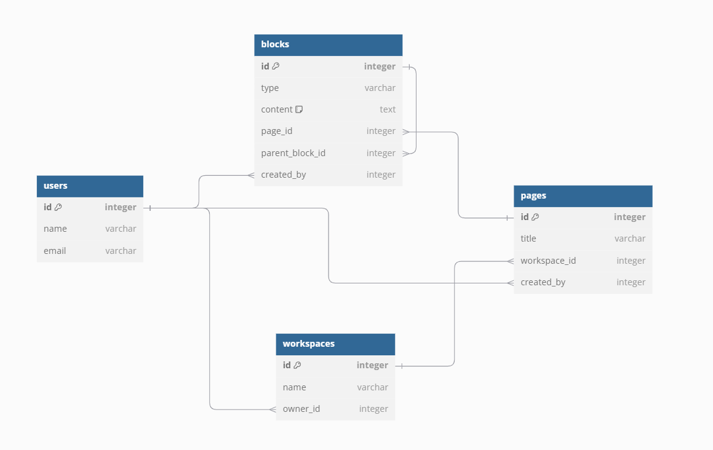

# 노션 클론코딩 프로젝트

## 프로젝트 계기

스터디를 시작하면서 노션에서 팀스페이스를 사용하려고하는데 3일쓰니깐 결제 유도해서 화나가지고 시작한 프로젝트

# 애플리케이션 기능 목록

## 주요 기능

### 1. 메모 생성

* **새 메모 작성**
  * 제목 입력
  * 내용 입력
* **메모 저장**
  * 작성된 메모를 데이터베이스에 저장

### 2. 메모 조회

* **메모 목록 보기**
  * 모든 메모의 제목과 간략한 정보 목록 표시
* **메모 상세 보기**
  * 선택한 메모의 제목과 상세 내용 표시

### 3. 메모 수정

* **메모 수정 폼**
  * 기존 메모의 제목과 내용을 수정할 수 있는 폼 제공
* **수정된 메모 저장**
  * 수정된 내용을 데이터베이스에 업데이트

### 4. 메모 삭제

* **메모 삭제 기능**
  * 선택한 메모를 데이터베이스에서 삭제
  * 삭제 확인 메시지 표시

### 5. 검색 기능

* **메모 검색**
  * 제목 또는 내용 기반으로 메모 검색
  * 검색 결과 목록 표시

## UI/UX 기능

### 1. 반응형 디자인

* 노션과 같은 레이아웃의 반응형 디자인

### 2. 사용자 인터페이스 개선

* **직관적인 네비게이션**
  * 메모 목록, 작성, 수정, 삭제로의 쉬운 이동
* **모던한 디자인**
  * 깔끔하고 사용하기 쉬운 UI 구성

## ERD

### 사용자 (User)
- **ID**: 각 사용자를 고유하게 식별하는 ID.
- **이름 (Name)**: 사용자의 이름.
- **이메일 (Email)**: 사용자의 고유 이메일 주소.
- **관계**:
  - 한 사용자는 여러 개의 워크스페이스를 소유할 수 있습니다.
  - 한 사용자는 여러 페이지와 블록을 생성할 수 있습니다.

### 워크스페이스 (Workspace)
- **ID**: 각 워크스페이스를 고유하게 식별하는 ID.
- **이름 (Name)**: 워크스페이스 이름.
- **소유자 (Owner)**: 해당 워크스페이스를 소유한 사용자.
- **관계**:
  - 한 워크스페이스는 여러 개의 페이지를 포함합니다.
  - 한 워크스페이스는 한 명의 사용자에 의해 소유됩니다.

### 페이지 (Page)
- **ID**: 각 페이지를 고유하게 식별하는 ID.
- **제목 (Title)**: 페이지의 제목.
- **워크스페이스**: 페이지가 속한 워크스페이스.
- **생성자 (Created By)**: 페이지를 생성한 사용자.
- **관계**:
  - 한 페이지는 하나의 워크스페이스에 속합니다.
  - 한 페이지는 여러 개의 블록을 포함할 수 있습니다.

### 블록 (Block)
- **ID**: 각 블록을 고유하게 식별하는 ID.
- **유형 (Type)**: 블록의 유형 (예: 텍스트, 이미지 등).
- **내용 (Content)**: 블록의 내용.
- **부모 블록 (Parent Block)**: 블록은 다른 블록을 부모로 가질 수 있으며, 이는 블록의 중첩을 나타냅니다.
- **생성자 (Created By)**: 블록을 생성한 사용자.
- **관계**:
  - 블록은 하나의 페이지에 속할 수 있습니다.
  - 블록은 여러 개의 자식 블록을 포함할 수 있습니다.
